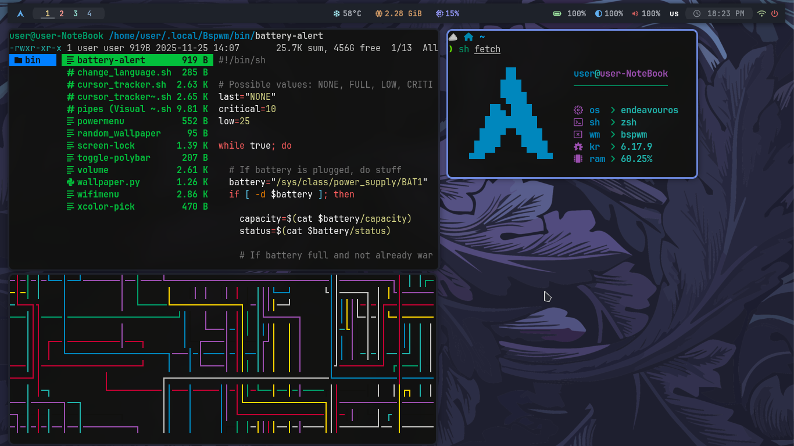
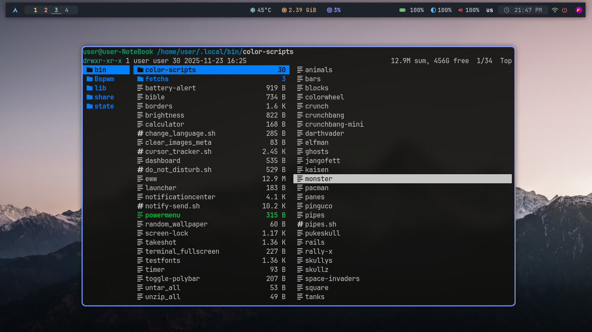
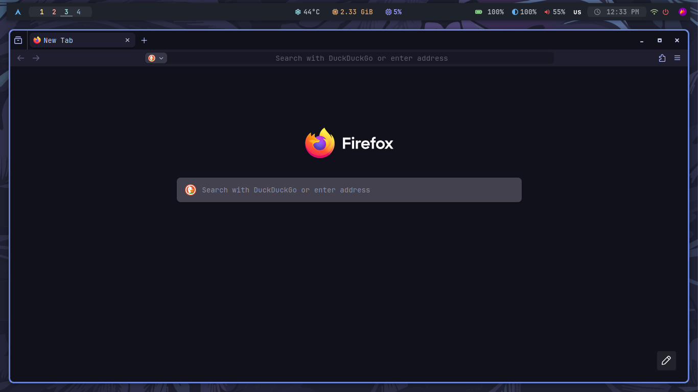
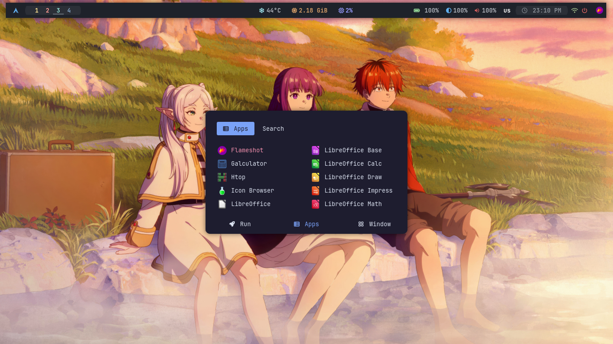

# ✨ Bspwm-dotfiles

A **minimal, clean, and highly productive bspwm setup** designed for users who value efficiency, speed, and a smooth workflow.  
These dotfiles are lightweight, fully customizable, and ready to use — perfect for anyone who wants a **beautiful, distraction-free desktop** that helps you stay focused and get things done.  

Join hundreds of users who enjoy **fast, organized, and elegant workspace management** with this setup!

## 🖥️ System Overview

 

- **OS:** EndeavourOS  
- **WM:** Bspwm  
- **Bar:** Polybar  
- **Compositor:** Picom  
- **Terminal:** Alacritty  
- **Shell:** Zsh  
- **App Launcher:** Rofi  
- **Notify Daemon:** Dunst  

 

## 📸 Desktop Preview

## ⚡ Features

- ✨ **Minimal and clutter-free** bspwm setup for ultimate focus  
- ⌨️ **Efficient keybindings** via sxhkd to navigate faster  
- 🛠️ **Lightweight scripts** to enhance daily workflow  
- 🎨 **Customizable themes, fonts, and colors** for a visually appealing environment  
- 📊 **Pre-configured Polybar** for a clean, informative status bar  
- 🚀 **Optimized for speed and productivity** — perfect for work and development  
- 📦 **Organized structure** making it easy to tweak and adapt  
- 🌟 Ready-to-use configuration so you can set up your environment **in minutes**  

> ⚠️ **Note:** This configuration was primarily created and tested for a screen resolution of **1366×768**. Adjustments may be needed for other resolutions.

## ▶️ Usage

- Start bspwm via your display manager or `startx`  
- `sxhkd` runs automatically  
- Polybar and scripts are pre-configured  
- Customize colors, fonts, and scripts in `~/.Bspwm-dotfiles`  

## 🙏 Acknowledgements

Special thanks to **[ZProger](https://www.youtube.com/@ZProger)** for inspiration and many configuration ideas used in this setup.

## 🤝 Contributing

Feel free to **fork** and submit pull requests.  
Keep commits organized and clean.  
