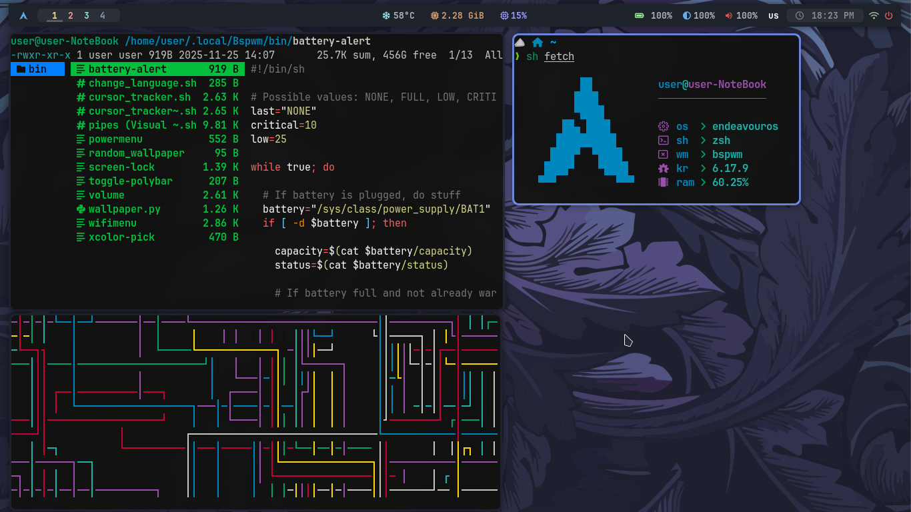
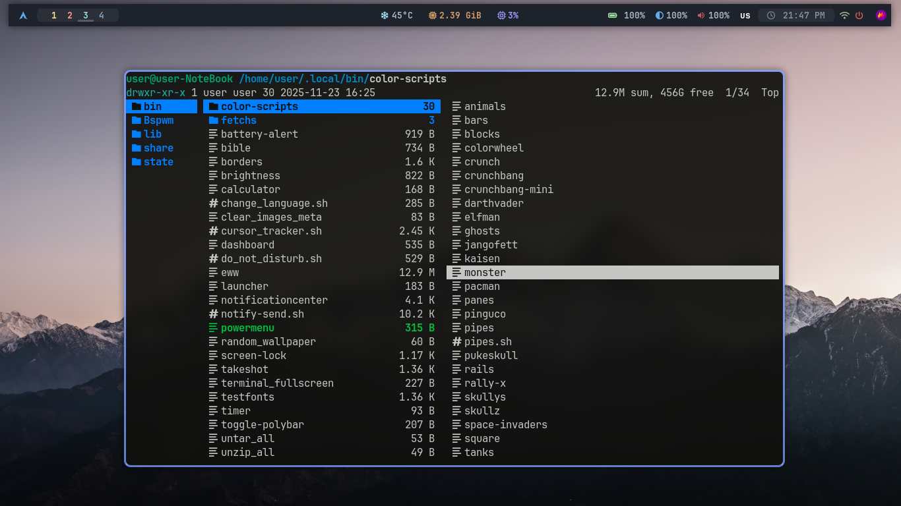
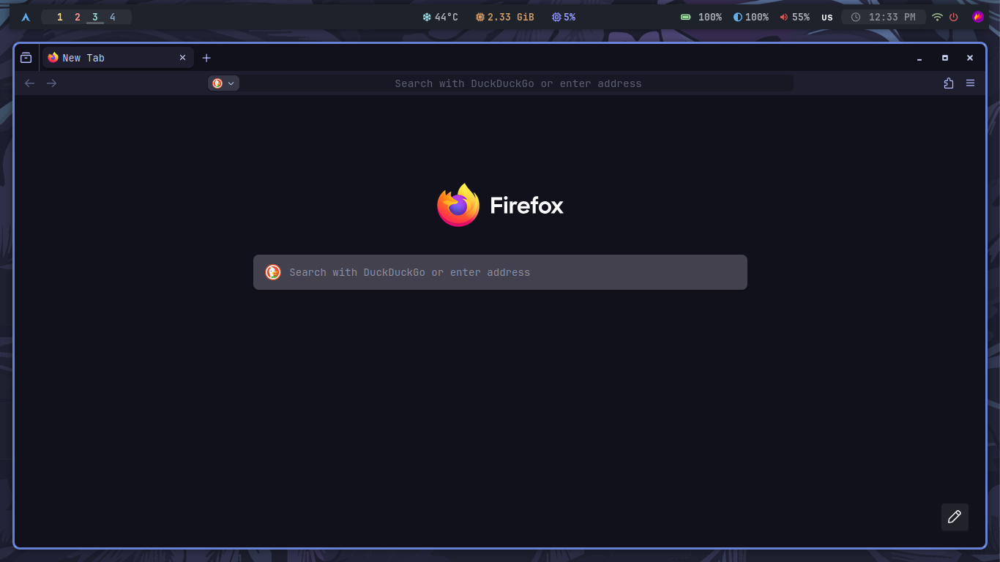
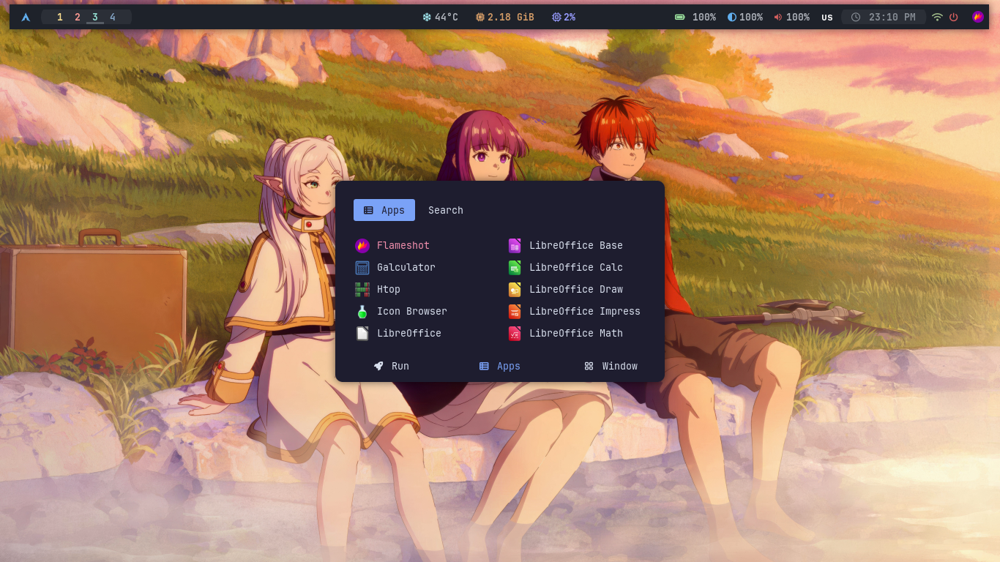

# ✨ Bspwm-dotfiles

A **minimal, clean, and highly productive bspwm setup** designed for users who value efficiency, speed, and a smooth workflow.  
These dotfiles are lightweight, fully customizable, and ready to use — perfect for anyone who wants a **beautiful, distraction-free desktop** that helps you stay focused and get things done.  

Join hundreds of users who enjoy **fast, organized, and elegant workspace management** with this setup!

## 🖥️ System Overview



</br>

- **OS:** [**`Arch`**](https://archlinux.org)
- **WM:** [**`Bspwm`**](https://github.com/baskerville/bspwm) 
- **Bar:** [**`Polybar`**](https://github.com/polybar/polybar)  
- **Compositor:** [**`Picom`**](https://github.com/yshui/picom)  
- **Terminal:** [**`Alacritty`**](https://github.com/alacritty/alacritty)  
- **Shell:** [**`Zsh`**](https://github.com/zsh-users/zsh) [**`(Oh My Zsh)`**](https://github.com/ohmyzsh/ohmyzsh)
- **App Launcher:** [**`Rofi`**](https://github.com/davatorium/rofi)  
- **Notify Daemon:** [**`Dunst`**](https://github.com/dunst-project/dunst) 

</br>

## 📸 Desktop Preview






## ⚡ Features

- ✨ **Minimal and clutter-free** bspwm setup for ultimate focus  
- ⌨️ **Efficient keybindings** via sxhkd to navigate faster  
- 🛠️ **Lightweight scripts** to enhance daily workflow  
- 🎨 **Customizable themes, fonts, and colors** for a visually appealing environment  
- 📊 **Pre-configured Polybar** for a clean, informative status bar  
- 🚀 **Optimized for speed and productivity** — perfect for work and development  
- 📦 **Organized structure** making it easy to tweak and adapt  
- 🌟 Ready-to-use configuration so you can set up your environment **in minutes**  

> ⚠️ **Note:** This configuration was primarily created and tested for a screen resolution of **1366×768**. Adjustments may be needed for other resolutions.

## ⌨️ Hotkeys

  <details>
  <summary>Hotkeys for Tmux</summary>

  ### **Quick Access to Windows**
  - `M-1` to `M-9`: Switch to window 1-9.

  ### **Pane Navigation**
  - `M-Left`: Move to the left pane.
  - `M-Right`: Move to the right pane.
  - `M-Up`: Move to the top pane.
  - `M-Down`: Move to the bottom pane.

  ### **Pane Resizing**
  - `M-C-Left`: Resize pane to the left.
  - `M-C-Right`: Resize pane to the right.
  - `M-C-Up`: Resize pane upwards.
  - `M-C-Down`: Resize pane downwards.

  ### **Window and Pane Management**
  - `M-h`: Split window vertically.
  - `M-v`: Split window horizontally.
  - `M-Enter`: Create a new window.
  - `M-c`: Close the current pane.
  - `M-q`: Close the current window.
  - `M-d`: Detach from the tmux session.
  - `M-C-q`: Confirm to kill the entire session.

  ### **Reload Configuration**
  - `M-r`: Reload tmux configuration.
  - `M-s`: Choose a tmux session tree.

  ### **Copying and Searching**
  - `M-/`: Start copy mode and search forward.
  - `M-?`: Start copy mode and search backward.
  - `v`: Begin selection in copy mode.
  - `y`: Copy selected text to clipboard.

</details>

<details>
<summary>Hotkeys for Bspwm</summary>

### **System & Daemon Control**
- `Super + Escape + r` — Reload sxhkd configuration
- `Ctrl + Shift + q` — Quit BSPWM
- `Ctrl + Shift + r` — Reload BSPWM


### **Launchers & Utilities**
- `Super + Return` — Open terminal (Alacritty)
- `Super + d` — Rofi (drun)
- `Super + x` — Power menu
- `Super + p` — Toggle Polybar
- `Super + w` — Random wallpaper
- `Print` — Screenshot (Flameshot)
- `Alt + Shift` — Change keyboard layout

### **Application Shortcuts**
- `Super + Shift + f` — Firefox
- `Super + Shift + n` — Thunar
- `Super + Shift + p` — Pavucontrol
- `Super + Shift + i` — Firefox (private)
- `Super + Shift + l` — Lock screen
- `Super + Shift + x` — Color picker

### **Volume & Brightness**
- `XF86AudioRaiseVolume` — Volume up
- `XF86AudioLowerVolume` — Volume down
- `XF86AudioMute` — Toggle mute
- `XF86MonBrightnessUp` — Brightness up
- `XF86MonBrightnessDown` — Brightness down

### **Window State & Layout**
- `Super + Space` — Toggle tiled / floating
- `Super + t` — Tiled mode
- `Super + Ctrl + t` — Pseudo-tiled mode
- `Super + f` — Fullscreen
- `Super + c` — Close window

### **Focus & Navigation**
- `Alt + Tab` — Focus next window
- `Alt + Shift + Tab` — Focus previous window
- `Super + Tab` — Focus last window
- `Super + Grave` — Focus last node / desktop

### **Desktops & Window Movement**
- `Super + {1–9}` — Focus desktop
- `Super + Shift + {1–9}` — Move window to desktop

### **Preselection**
- `Super + Ctrl + {1–9}` — Set split ratio
- `Super + Ctrl + Space` — Cancel preselection (node)
- `Super + Ctrl + Shift + Space` — Cancel preselection (desktop)

### **Resize & Move**
- `Super + Ctrl + h/j/k/l` — Resize window
- `Super + h/j/k/l` — Move window
- `Super + Alt + h/j/k/l` — Swap window

### **Window Flags**
- `Super + Ctrl + m` — Mark window
- `Super + Ctrl + x` — Lock window
- `Super + Ctrl + y` — Sticky window
- `Super + Ctrl + z` — Private window

### **Advanced**
- `Super + g` — Swap with biggest window

</details>

<details>
<summary>Hotkeys for Ranger</summary>

### Basic
- `q` — Quit
- `Q` — Quit All
- `R` — Reload Current Directory
- `:` / `;` — Open Console
- `i` — Display File
- `Alt + j / Alt + k` — Scroll Preview
- `<Space>` — Toggle Mark
- `v` — Mark All
- `uv` — Unmark All
- `V / uV` — Toggle Visual Mode

### Navigation
- `gh` — Go Home
- `ge` — Go to /etc
- `gu` — Go to /usr
- `gd` — Go to /dev
- `gl` — Go to Previous Directory
- `gM` — Go to /mnt
- `gr` — Go to Root

### File Operations
- `yy` — Copy
- `dd` — Cut
- `pp` — Paste
- `dD` — Delete
- `dT` — Trash
- `cw` — Rename
- `a` — Rename Append

### Tabs & Sorting
- `Ctrl + n` — New Tab
- `Ctrl + w` — Close Tab
- `Tab / Shift + Tab` — Move Tab
- `gt / gT` — Next / Previous Tab
- `os` — Sort by Size
- `ob` — Sort by Name
- `on` — Natural Sort
- `or` — Toggle Reverse Sort

### Preview & Display
- `zp` — Preview Files
- `zP` — Preview Directories
- `zc` — Collapse Preview
- `zh / Ctrl + h` — Toggle Hidden Files
- `zi` — Toggle Preview Images
- `zv` — Toggle Use Preview Script
- `zm` — Toggle Mouse

### Search & Filter
- `/` — Search
- `n` — Next Search
- `N` — Previous Search
- `zf` — Filter Console

</details>

<details>
  <summary>Hotkeys for MPV Player</summary>

  ### **Playback Control**
  - `Left` / `Right`: Exact seek backward/forward 5 seconds.
  - `Shift+Left` / `Shift+Right`: Exact seek backward/forward 30 seconds.
  - `[` / `]`: Decrease/increase playback speed by 0.25x.
  - `\`: Reset playback speed to 1.0x.
  - `q`: Quit player.

  ### **Video & Aspect Ratio**
  - `A`: Cycle aspect ratios (16:9 -> 4:3 -> 2.35:1 -> Reset).
  - `ctrl+s`: Take asynchronous screenshot.
  - `alt+i`: Show list of all active hotkeys.

  ### **Audio & Volume**
  - `Mouse Wheel` / `Up` / `Down`: Change volume by 5%.
  - `m`: Toggle mute.
  - `a`: Open audio track selection menu.
  - `ctrl++` / `ctrl+-`: Adjust audio delay by 100ms.

  ### **Subtitles**
  - `v`: Toggle subtitle visibility.
  - `s`: Open subtitle selection menu.
  - `S`: Load external subtitle file.
  - `z` / `x`: Adjust subtitle delay by 100ms.

  ### **Navigation & Menus (uosc)**
  - `RMB (Right Click)`: Main context menu.
  - `p`: Playlist / current items.
  - `c`: Chapters menu.
  - `o`: Open file via built-in browser.
  - `O`: Show current file in system file manager.

</details>

## 🛠️ Installer

This **Installer** is designed for a smooth setup of Bspwm-dotfiles.  
Here, you can **choose which options to install**, instead of manually searching for and installing packages.

### Installation Steps

**1. Install required dependencies via pacman:**
```sh
sudo pacman -Syu python git
```
**2. Clone the repository:**
```sh
git clone https://github.com/human624/Bspwm-dotfiles.git
```
**3. Navigate to the Installer folder:**
```sh
cd Bspwm-dotfiles/Installer
```
**4. Run the installer script:**
```sh
python3 install.py
```
> ⚡ Once the script starts, you can select the categories and options you want to install.
This gives you full control over which parts of the Bspwm-dotfiles environment are installed on your system.

This approach ensures a flexible, interactive, and user-friendly installation, letting you configure your desktop environment exactly the way you want.

## 🙏 Acknowledgements

Special thanks to **[ZProger](https://www.youtube.com/@ZProger)** for inspiration and many configuration ideas used in this setup.
